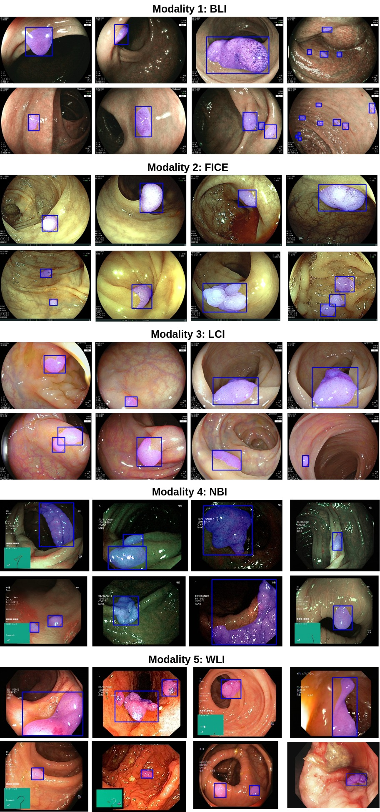
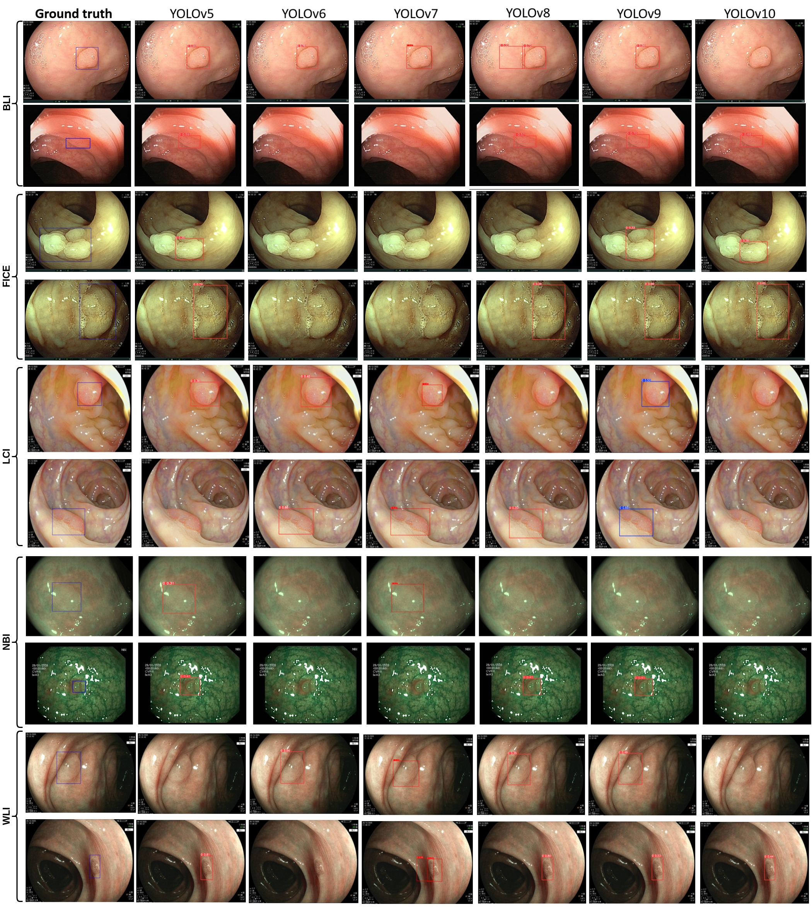

*****PolypDB: A Curated Multi-Center Dataset for Development of AI Algorithms in Colonoscopy*****

https://arxiv.org/pdf/2409.00045

**Overview**

PolypDB is a large-scale, multi-center, and multi-modality dataset designed for the development of advanced AI algorithms in colonoscopy. The dataset comprises 3,934 polyp images from various imaging modalities and medical centers, offering a rich resource for research in polyp detection and segmentation.

PolypDB addresses the critical need for robust and generalizable data for developing computer-aided diagnosis (CAD) systems. This dataset is publicly available and is designed to facilitate research and development in the medical AI community.

**<u>Features</u>**

- **Multi-Modality Data**: Includes images from BLI, FICE, LCI, NBI, and WLI modalities.
- **Multi-Center Data**: Sourced from three medical centers in Norway, Sweden, and Vietnam.
- **High-Quality Annotations**: Verified by a team of 10 gastroenterologists with over 10 years of experience.
- **Comprehensive Benchmarking**: Includes benchmark results on eight popular segmentation methods and six standard detection methods.
- **Publicly Accessible**: The dataset is open for research and educational purposes. [Download it here](https://osf.io/pr7ms/).

**Dataset Structure**

The dataset is organized into modality-wise and center-wise folders, each containing images and their corresponding ground truth annotations:

**PolypDB Modality Based Structure**
<pre>
 ├── BLI/
│   ├── images/
│   └── annotations/
├── FICE/
│   ├── images/
│   └── annotations/
├── LCI/
│   ├── images/
│   └── annotations/
├── NBI/
│   ├── images/
│   └── annotations/
└── WLI/
    ├── images/
    └── annotations/
</pre>

**PolypDB Center-wise Structure**
<pre>
├── Simula/
│   ├── images/
│   ├── annotations/
│   └── bounding_boxes/
├── Karolinska/
│   ├── images/
│   ├── annotations/
│   └── bounding_boxes/
└── Vietnam/
    ├── images/
    ├── annotations/
    └── bounding_boxes/
 </pre>

**Dataset samples**

## Results
 ***Qualitative results comparison of the SOTA methods***  

**Polyp detection results** 

**Download the dataset:**

***Download the dataset and place it in the corresponding directories.***
The dataset can be downloaded using [https://osf.io/pr7ms/](https://osf.io/pr7ms/). 

***If you use PolypDB in your research, please cite the following paper:**

**License**

This project is licensed under the MIT License - see the LICENSE file for details.

**Citations**

<pre>
 @article{Jha2024PolypDB,
  author = {Debesh Jha and et al.},
  title = {PolypDB: A Curated Multi-Center Dataset for Development of AI Algorithms in Colonoscopy},
  journal = {Arxiv},
  year = {2024},
  doi = {10.1109/TMI.2024.1234567}
} 
</pre>

**Contact**

For any inquiries, please contact Debesh Jha (debesh.jha@usd.edu).

**Contributing**

We welcome contributions to PolypDB! If you have any suggestions or improvements, please feel free to submit a pull request or open an issue.
